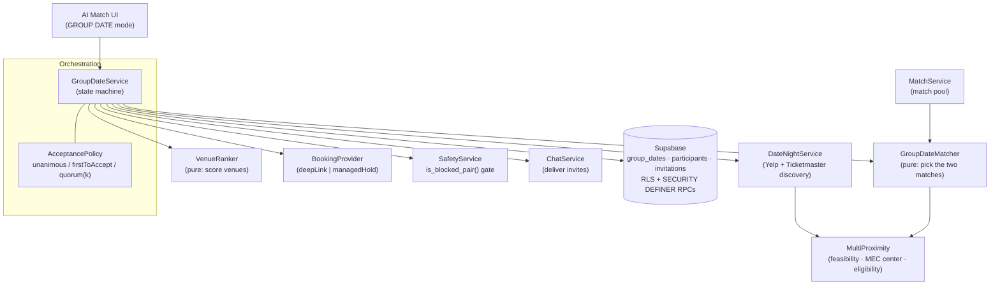
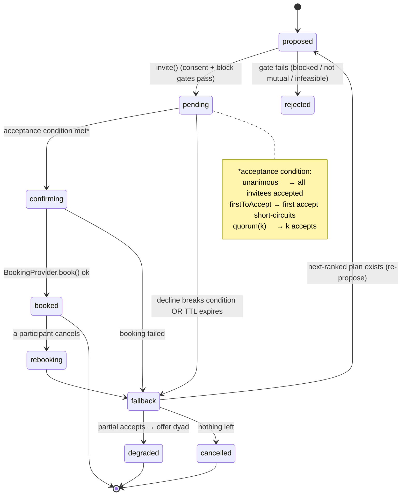
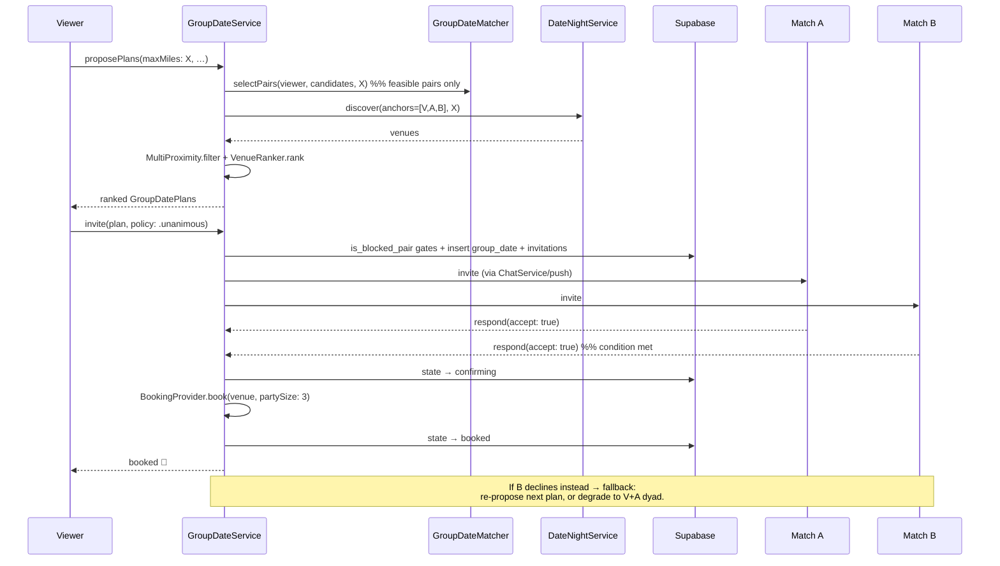
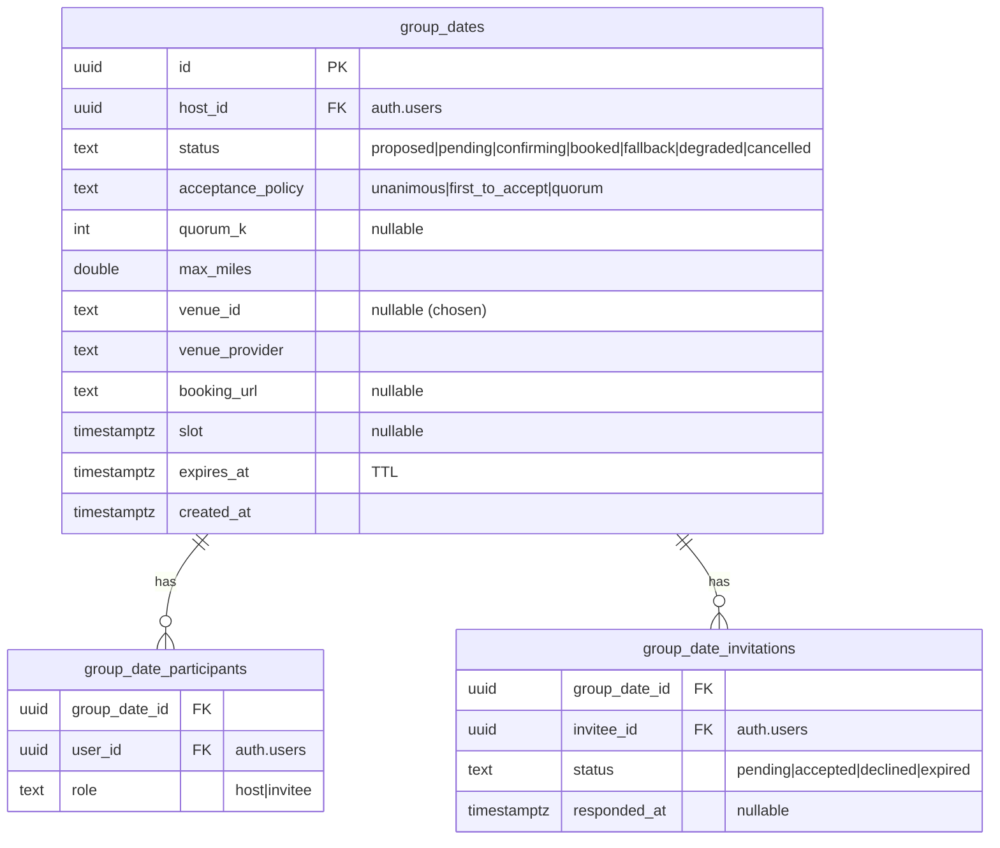

# Group DateNight RSVP — System & Component Design

> Design for the **Group DateNight** feature specified in [`group-datenight-rsvp-algorithm.md`](./group-datenight-rsvp-algorithm.md): a viewer invites **two matches** to RSVP to one venue within **X miles of all three**, then books the group.
>
> **Design decisions (forks resolved as seams, not choices):**
>
> - **Acceptance model** → pluggable `AcceptancePolicy` (`unanimous` | `firstToAccept` | `quorum(k)`). The triad machine supersets first-to-accept.
> - **Booking depth** → `BookingProvider` capability (`deepLink` | `managedHold`). v1 ships `deepLink`.
>
> **Scope:** interfaces, state machine, data model, schema, sequence flows. **Not** implementation (→ `/sc:implement`).

---

## 1. Fit with existing architecture

Follows the repo's established seams, so it drops in without new patterns:

- **DI:** add `groupDate: any GroupDateService` to `AppEnvironment` (mock + live), exactly like `dateNight`.
- **Protocol + mock + live:** every new service is a `public protocol` with a `Mock…` (previews/tests/Simulator) and a live impl (Supabase/providers), matching `Protocols.swift`.
- **Server-authoritative:** group state, invitations, and consent live in Supabase behind RLS + `SECURITY DEFINER` RPCs; the client never trusts its own copy for blocking or booking.
- **Reuses:** `MultiProximity` (geometry, implemented), `DateNightService` (Yelp/Ticketmaster discovery), `SafetyService` + `is_blocked_pair` (block gate), `ChatService` (invite delivery), `MatchService` (the pool).

---

## 2. Component architecture



**Layering:** UI → `GroupDateService` (orchestrator) → pure planners (`GroupDateMatcher`, `VenueRanker`, `MultiProximity`) + effectful collaborators (`DateNightService`, `BookingProvider`, `SafetyService`, `ChatService`, Supabase). Pure planners are independently unit-testable with zero I/O — the pattern the 150-test suite already rewards.

---

## 3. Interface definitions

Signatures only (bodies are `/sc:implement`). All `Sendable`, `async throws` where effectful, matching `Protocols.swift`.

### 3.1 Generalized discovery (extend existing `DateNightQuery`)

```swift
public struct DateNightQuery: Sendable, Equatable {
    public var anchors: [GeoCoordinate]          // was: viewer + match (2). Now N.
    public var maxMiles: Double                  // was: hardcoded 10. Now the "X".
    public var categories: Set<DateNightCategory>
    public var term: String?

    public var partySize: Int { anchors.count }                       // was static 2
    public var center: GeoCoordinate? { MultiProximity.center(of: anchors) }
    public var searchRadiusMiles: Double? {
        MultiProximity.searchRadiusMiles(anchors: anchors, maxMiles: maxMiles)
    }
}
// DateNightService.discover(_:) signature is UNCHANGED — it just receives N anchors.
```

_Migration note:_ keep a 2-arg convenience init (`viewer:match:`) so the current 1:1 call site compiles untouched.

### 3.2 Orchestration

```swift
public enum AcceptancePolicy: Sendable, Equatable {
    case unanimous               // triad: all invitees must accept  (default)
    case firstToAccept           // "invite two, first to accept becomes the date"
    case quorum(Int)             // k of n
}

public protocol GroupDateService: Sendable {
    /// Rank feasible (match-pair, venue) plans for the viewer within `maxMiles`.
    func proposePlans(maxMiles: Double,
                      categories: Set<DateNightCategory>,
                      limit: Int) async throws -> [GroupDatePlan]

    /// Create a GroupDate from a chosen plan and send invites. Applies consent/block gates.
    func invite(plan: GroupDatePlan, policy: AcceptancePolicy) async throws -> GroupDate

    /// An invitee responds. Advances the state machine per policy.
    func respond(groupDateID: GroupDate.ID, as invitee: UUID, accept: Bool) async throws -> GroupDate

    /// Book once the policy's acceptance condition is met (idempotent).
    func book(groupDateID: GroupDate.ID) async throws -> GroupDate

    func cancel(groupDateID: GroupDate.ID, by user: UUID) async throws -> GroupDate
    func groupDate(_ id: GroupDate.ID) async throws -> GroupDate
}
```

### 3.3 Pure planners

```swift
public enum GroupDateMatcher {                     // Stage 0 — which two to invite
    public static func selectPairs(viewer: GeoCoordinate,
                                   candidates: [Candidate],
                                   maxMiles: Double,
                                   weights: MatchWeights = .default,
                                   limit: Int) -> [CandidatePair]   // feasible-only, ranked
}

public enum VenueRanker {                          // Stage 4 — rank eligible venues
    public static func rank(_ places: [DateNightPlace],
                            anchors: [GeoCoordinate],
                            maxMiles: Double,
                            triadInterests: Set<String>,
                            weights: VenueWeights = .default) -> [DateNightPlace]
}
```

### 3.4 Booking seam

```swift
public enum BookingCapability: Sendable { case deepLink, managedHold }

public protocol BookingProvider: Sendable {
    var capability: BookingCapability { get }
    /// deepLink → returns the provider URL; managedHold → places a real hold for `partySize`.
    func book(_ place: DateNightPlace, partySize: Int, slot: Date?) async throws -> BookingResult
}
```

---

## 4. State machine

Parameterized by `AcceptancePolicy` — the same machine expresses all three interaction models.



- **TTL** on `pending` (default 24 h; a "tonight" mode uses a short TTL). Enforced server-side (a scheduled RPC / `expires_at` check), never by the client clock.
- **Idempotency:** `book()` keyed by `(group_date_id, venue_id, slot)`; retries never double-book.

---

## 5. Sequence — happy path + a decline



---

## 6. Data model & schema (Supabase)

Follows repo conventions: `public.*`, snake_case, FKs to `auth.users(id) on delete cascade`, RLS enabled, mutations only through `SECURITY DEFINER` RPCs, idempotent/additive migration (`0010_group_datenight.sql`).



**RPCs (SECURITY DEFINER, `execute` revoked from `anon`):**

- `create_group_date(p_invitees uuid[], p_max_miles, p_policy, p_quorum_k)` — **rejects** if any pair fails `is_blocked_pair` or is not a mutual match; inserts rows atomically; returns id.
- `respond_group_invite(p_group_date_id, p_accept bool)` — caller = `auth.uid()`; updates invitation, recomputes group status per policy, sets `expires_at` respected.
- `book_group_date(p_group_date_id, p_venue_id, p_provider, p_booking_url, p_slot)` — host only; idempotent on `(group_date_id, venue_id, slot)`.
- `cancel_group_date(p_group_date_id)` — participant only.
- Scheduled `expire_group_dates()` — flips timed-out `pending` → `fallback`.

**RLS:** a row is visible only to its participants (`user_id = auth.uid()` via the participants table). Invitations readable by host + that invitee. `moderation`-style tables stay client-invisible; all writes go through the RPCs above (mirrors the `0009` safety pattern).

---

## 7. Safety & consent design (brand-critical)

| Gate                  | Where enforced                    | Mechanism                                                                                                               |
| --------------------- | --------------------------------- | ----------------------------------------------------------------------------------------------------------------------- |
| No blocked pairing    | server, in `create_group_date`    | `is_blocked_pair(a,b)` across all 3 pairwise combos → reject                                                            |
| Mutual-match only     | server RPC                        | invitees must be mutual matches of host                                                                                 |
| Location fuzzing      | client + `GroupDateMatcher` input | anchors are **fuzzed** (neighborhood/ZIP centroid); MEC computed on fuzzed anchors; only _venue_ location ever revealed |
| Public venues only    | `VenueRanker` / category gate     | group first-dates restricted to public categories                                                                       |
| Silent decline        | server + delivery                 | a decline/timeout never notifies the other invitee                                                                      |
| Consent to be grouped | invitation `pending`              | nobody is "in" a group until they accept                                                                                |

---

## 8. DI integration

```swift
// AppEnvironment
public let groupDate: any GroupDateService
// .mock  → MockGroupDateService()
// makeDefault() → LiveGroupDateService(dateNight:, safety:, chat:, supabase:, booking:)
//                 when Supabase + provider keys present; else mock.
```

No change to existing services; purely additive, same as `dateNight` shipped.

---

## 9. Validation

| Requirement / constraint                       | Satisfied by                                               |
| ---------------------------------------------- | ---------------------------------------------------------- |
| Venue within X mi of all three                 | `MultiProximity` (implemented, tested)                     |
| "invite two, first to accept" _and_ true triad | `AcceptancePolicy` — one machine, config enum              |
| Seamless RSVP now, real holds later            | `BookingProvider` capability seam                          |
| Safety-first (blocks, fuzzing, consent)        | §7, all server-enforced                                    |
| Fits protocol+mock+live+DI patterns            | §1, §8                                                     |
| Server-authoritative, RLS, additive migration  | §6, mirrors `0009`                                         |
| Testability                                    | pure `GroupDateMatcher` / `VenueRanker` / `MultiProximity` |

---

## 10. Handoff → `/sc:implement`

Suggested build order (each independently testable):

1. **Generalize `DateNightQuery`** to `anchors + maxMiles` (+ 2-arg convenience init); wire `MultiProximity` into `LiveDateNightService`. _(No behavior change for the existing 1:1 flow — guard with tests.)_
2. **`GroupDateMatcher` + `VenueRanker`** (pure) with unit tests (weights, fairness, feasibility gating).
3. **Migration `0010_group_datenight.sql`** — tables, RLS, RPCs (block gates), scheduled expiry.
4. **`GroupDateService`** — `MockGroupDateService` first (drives UI + state-machine tests), then `LiveGroupDateService`.
5. **AI Match "GROUP DATE" UI** — pick two matches → ranked plans → invite → status.
6. **`BookingProvider`** — `DeepLinkBookingProvider` for v1; managed-hold providers later.

**Open (implementation-time decisions, not blockers):** exact `MatchWeights`/`VenueWeights` tuning; "tonight" TTL length; which providers get `managedHold` first.
